# Three Musketeers Trilogy — Analysis Results

> Full results from the signed character-interaction network pipeline.
> For methodology and setup see [README.md](README.md).

---

## Corpus Overview

| Metric | Value |
|--------|-------|
| Total time steps (windows) | **370** |
| Unique characters (nodes, all books) | **269** |
| Total edge-instances (across all windows) | **56 631** |
| Mean nodes per window | 23.5 (min 11 / max 43) |
| Mean edges per window | 153 (min 37 / max 418) |
| Positive edges (overall) | **87.1 %** |
| Negative edges (overall) | 12.9 % |
| Mean edge sentiment (VADER compound) | **0.562** |
| Mean structural balance ratio | **0.858** |

---

## Per-Book Summary

| Book | Windows | Avg nodes | Avg edges | Avg sentiment | +edge % | Avg balance |
|------|---------|-----------|-----------|:-------------:|:-------:|:-----------:|
| *The Three Musketeers* | 58 | 22.9 | 152.6 | 0.496 | 83.6 % | 0.820 |
| *Twenty Years After* | 81 | 30.2 | 246.7 | 0.473 | 83.6 % | 0.824 |
| *The Vicomte de Bragelonne* | 66 | 21.2 | 113.6 | 0.630 | 90.6 % | 0.893 |
| *Ten Years Later* | 56 | 22.2 | 147.7 | 0.742 | 95.1 % | 0.930 |
| *Louise de la Vallière* | 58 | 20.4 | 108.5 | 0.660 | 94.1 % | 0.919 |
| *The Man in the Iron Mask* | 51 | 21.1 | 112.5 | 0.381 | 81.0 % | 0.763 |

---

## Top 15 Characters (by windows appeared in)

| Rank | Character | Role | Windows |
|------|-----------|------|---------|
| 1 | **Aramis** | Musketeer → bishop → schemer | 274 |
| 2 | **Athos** (Comte de La Fère) | Musketeer → gentleman father | 265 |
| 3 | **Louis XIV** | King of France | 255 |
| 4 | **Raoul** (Vicomte de Bragelonne) | Athos's son, soldier | 238 |
| 5 | **Porthos** (Baron du Vallon) | Musketeer → nobleman | 235 |
| 6 | **Mazarin** | Cardinal, chief minister | 221 |
| 7 | **Charles II** of England | Exiled prince → restored king | 197 |
| 8 | **Fouquet** | Superintendent of Finance | 194 |
| 9 | **Planchet** | D'Artagnan's valet | 179 |
| 10 | **Grimaud** | Athos's taciturn manservant | 176 |
| 11 | **Colbert** | Fouquet's rival minister | 172 |
| 12 | **Anne of Austria** | Queen Mother | 164 |
| 13 | **Louise de la Vallière** | Louis XIV's mistress | 159 |
| 14 | **Guiche** | Court favourite, Raoul's friend | 151 |
| 15 | **Richelieu** | Cardinal, royal antagonist | 150 |

---

## Book-Level Deep Dives

---

### Book 1 — *The Three Musketeers* (1844)

**Narrative context.** A young Gascon, d'Artagnan, arrives in Paris and joins Athos, Porthos, and Aramis in service to the King. The plot centres on foiling Cardinal Richelieu's schemes, protecting Queen Anne's honour (the diamond studs affair involving the Duke of Buckingham), and combating the mysterious femme fatale Milady de Winter. The story ends with Milady's execution and d'Artagnan's promotion to lieutenant.

**Windows:** 58 · **Chapters:** 1–67 · **Sentiment:** 0.106 → 0.851

#### Key characters

| Character | Windows | Wtd-degree | Role in this book |
|-----------|---------|-----------|-------------------|
| Athos | 58/58 | 18 649 | Central musketeer; highest-degree hub; mysterious past with Milady |
| Porthos | 58/58 | 14 642 | Musketeer; comic bravado and duelling |
| Aramis | 58/58 | 15 037 | Musketeer; religious ambivalence and intrigue |
| Planchet | 56/58 | 7 034 | d'Artagnan's valet; loyally carries missions |
| Bonacieux | 56/58 | 7 949 | d'Artagnan's landlord; wife becomes pawn of Richelieu |
| Tréville | 55/58 | 8 668 | Captain of the Musketeers; d'Artagnan's patron |
| Buckingham | 48/58 | 7 445 | English duke; Queen Anne's secret admirer |
| Milady | 39/58 | 12 074 | Richelieu's agent; Athos's former wife |

#### Strongest relationships

| Pair | Weight | Sentiment | Reading |
|------|-------:|:--------:|---------|
| Aramis ↔ Athos | 2 748 | +0.508 | Inseparable brotherhood; constant shared scenes |
| Athos ↔ Porthos | 2 626 | +0.487 | Brotherhood |
| Aramis ↔ Porthos | 2 477 | +0.478 | Brotherhood |
| Athos ↔ Richelieu | 1 268 | +0.484 | Adversarial but respectful; Richelieu appears in musketeer scenes |
| Felton ↔ Milady | 1 237 | +0.152 | Seduction plot — near-neutral because manipulation and danger |
| Athos ↔ Milady | 1 200 | +0.498 | Complex: abusive history, yet many shared scenes |

#### Most antagonistic ties (avg VADER compound across all windows, sign-eligible)

| Pair | Avg sentiment | Context |
|------|:------------:|---------|
| Dessessart ↔ Villeroy | −0.974 | Hostile minor confrontation |
| Bonacieux ↔ Villeroy | −0.971 | Constance's husband in threatening company |
| Lannoy ↔ Laporte | −0.808 | English court hostility scenes |
| Charles ↔ Laporte | −0.789 | King Charles I scenes of captivity |
| Anne ↔ Lubin | −0.770 | Espionage and suspicion around the Queen |

#### Sentiment arc

The narrative opens at moderate tension (~0.49), plunges in **windows 10–14** (~0.13–0.23) — the siege of La Rochelle and the first confrontations with Milady — then rises sharply through **windows 20–32** (0.65–0.85) during the diamond studs success and the Musketeers' triumphant London mission. It crashes at the end (**windows 56–57**, 0.21–0.11) as Milady poisons Constance Bonacieux and is captured and executed.

```
0.49 ──▼── 0.13 ──▲── 0.85 ──▼── 0.11
 start   siege/Milady  triumph  execution
```

#### Visualisations

**Community graph** — Louvain communities · node size ∝ degree · edge colour = sentiment sign

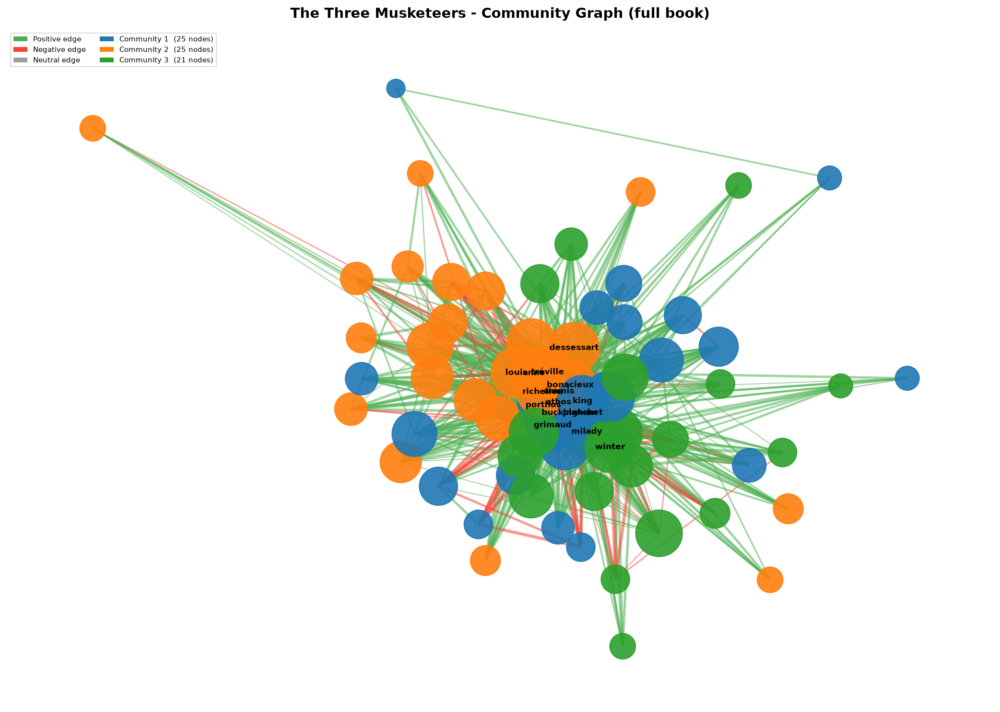

**Sentiment heatmap** — top-25 characters · RdYlGn (−1 → +1) · white = no direct edge

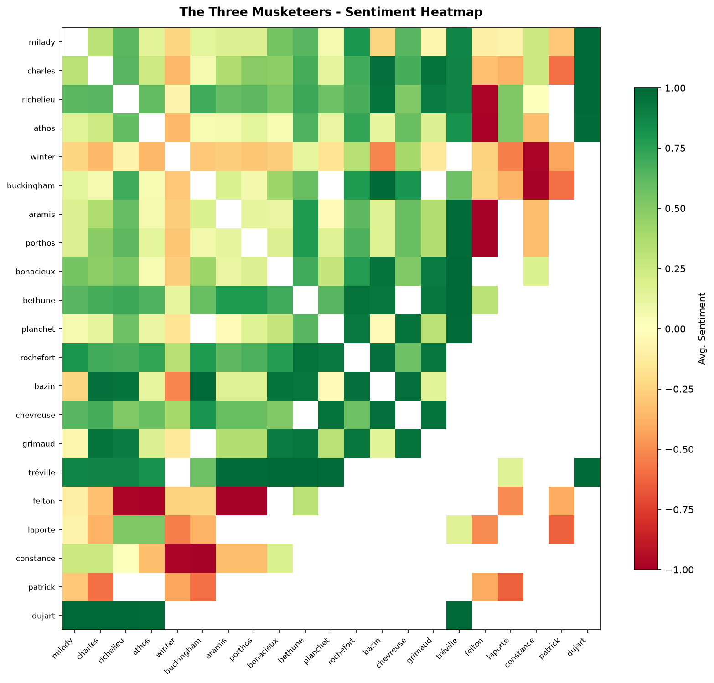

**Ego network — Queen (Anne of Austria)** — 1-hop neighbourhood · aggregate book graph · red = ego · green/red edges = positive/negative

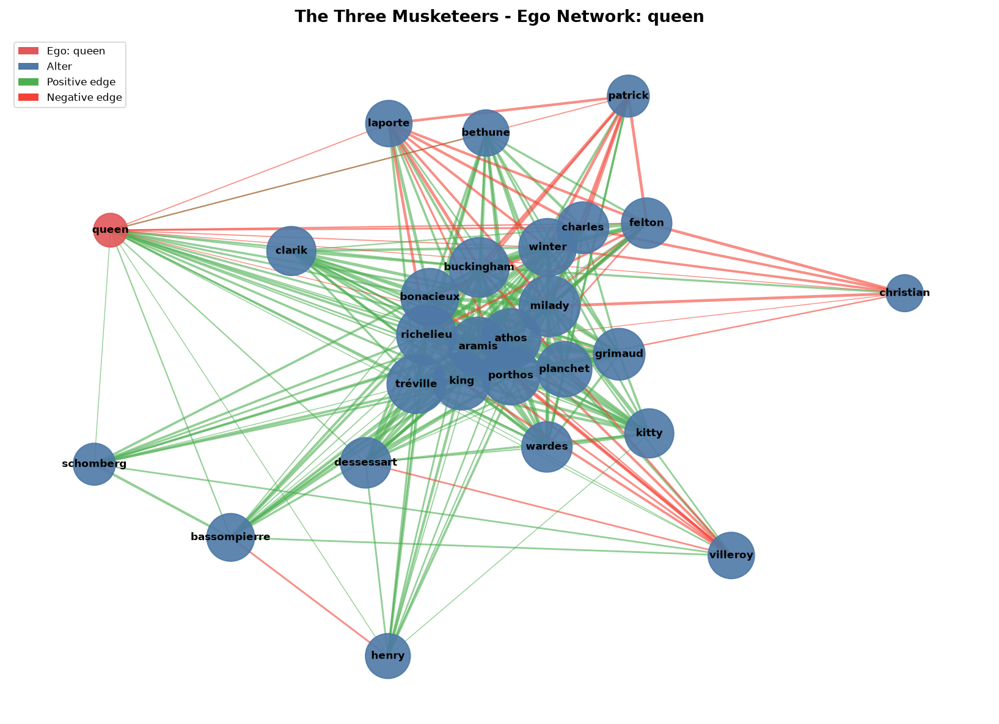

**Centrality rankings** (top-15 · bar colour = mean sentiment of incident edges)

| Betweenness | PageRank | Degree |
|:---:|:---:|:---:|
| 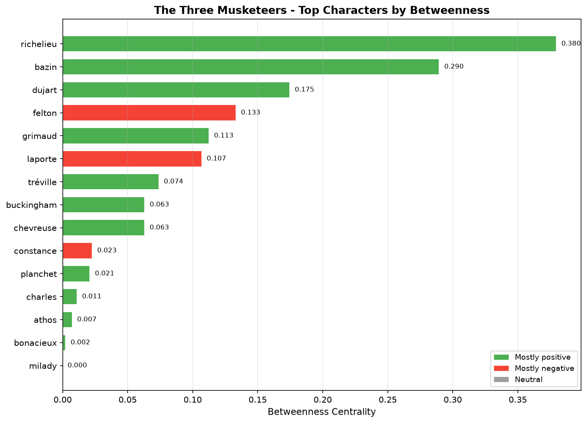 | 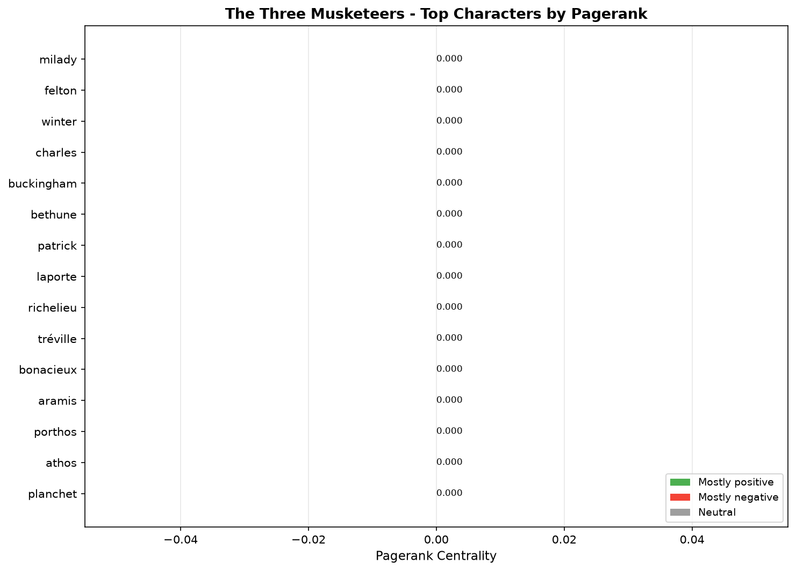 | 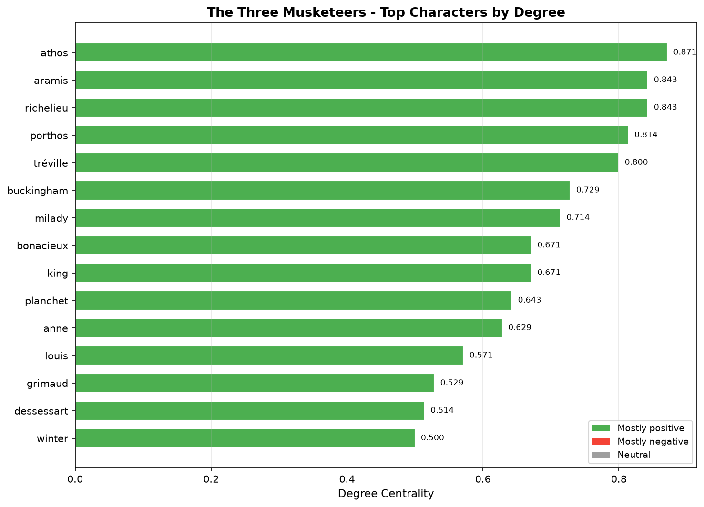 |

**Degree distribution** — log-log P(k) · red dashed = power-law fit

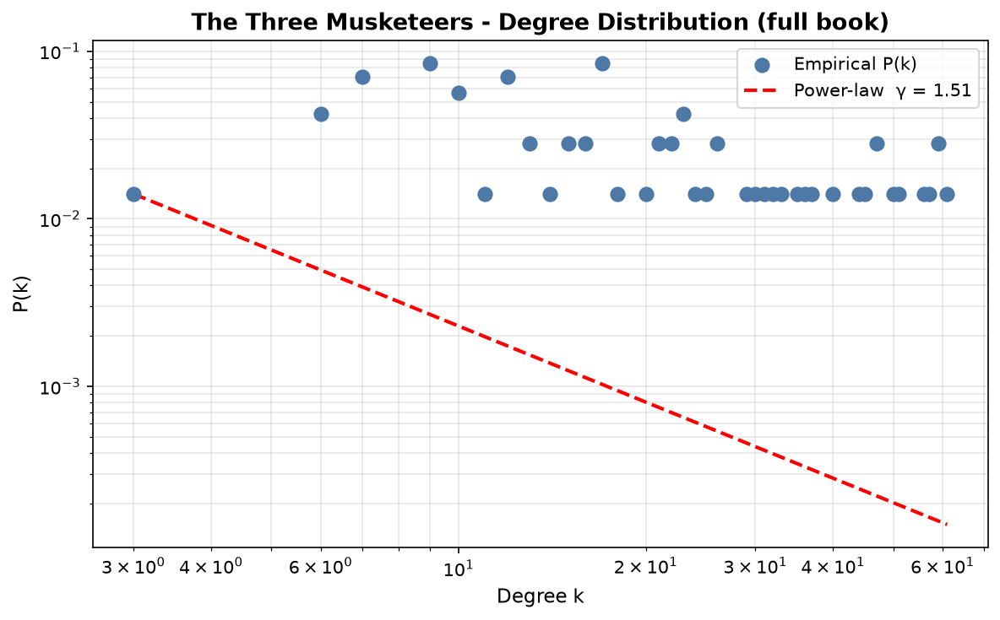

---

### Book 2 — *Twenty Years After* (1845)

**Narrative context.** The four musketeers are reunited twenty years later. France is in civil war (the Fronde), with Cardinal Mazarin as the despised chief minister. The musketeers are split: Athos and Aramis support the royal heir Charles II of England against Cromwell; Porthos is recruited by Mazarin; d'Artagnan serves the Cardinal. A key antagonist is Mordaunt, Milady's vengeful son. The book ends with Charles I's execution and the musketeers' escape.

**Windows:** 81 · **Chapters:** 1–90 · **Sentiment range:** −0.088 → 0.862

#### Key characters

| Character | Windows | Wtd-degree | Role |
|-----------|---------|-----------|------|
| Athos | 81/81 | 28 466 | Loyal protector of Charles II; highest weighted degree |
| Porthos | 81/81 | 23 426 | Physical powerhouse; recruited by Mazarin |
| Mazarin | 81/81 | 22 713 | Political antagonist; cowardly schemer |
| Aramis | 80/81 | 22 992 | Diplomatic, strategic musketeer |
| Charles II | 62/81 | 30 067 | Highest total weighted degree — pivot of the English plot |
| Grimaud | 72/81 | 9 302 | Athos's servant; loyal, taciturn |
| Raoul | 66/81 | 10 675 | Athos's young ward; first appearance as active character |
| Mousqueton | 58/81 | 6 693 | Porthos's valet; comic relief |

#### Strongest relationships

| Pair | Weight | Sentiment | Reading |
|------|-------:|:--------:|---------|
| Aramis ↔ Athos | 3 901 | +0.457 | Still the closest alliance in the network |
| Athos ↔ Charles II | 3 637 | +0.451 | Athos as Charles's chief supporter — defining new bond |
| Athos ↔ Porthos | 3 106 | +0.471 | Brotherhood maintained across factional divide |
| Aramis ↔ Charles II | 2 942 | +0.415 | Second musketeer–king bond |
| Charles II ↔ Porthos | 2 787 | +0.439 | Charles integrates into the musketeer core |
| Athos ↔ Mazarin | — | — | Adversarial; Mazarin briefly holds Athos prisoner |

#### Most antagonistic ties

| Pair | Avg sentiment | Context |
|------|:------------:|---------|
| Milady ↔ Mordaunt | −0.987 | Mordaunt's hatred of his mother's memory |
| Mordaunt ↔ Winter | −0.965 | Mordaunt kills his uncle Lord de Winter |
| Montrose ↔ Winter | −0.97 | Battle of Preston; English civil-war hostility |
| Comminges ↔ Raoul | −0.77 | Raoul detained by Mazarin's guards |

#### Sentiment arc

Book 2 opens positively (0.59–0.86, **windows 1–10**) — the joyful reunion of the musketeers. It then enters its **darkest valley** around **windows 25–31** (−0.09 to −0.05): this is the English civil war arc, Cromwell's trial and execution of Charles I, and Mordaunt's acts of vengeance. Sentiment recovers slowly through the Fronde arc but never fully returns to the book's opening optimism.

```
0.86 ──▼── -0.09 ──▲── 0.63 ──► 0.54
reunion  execution/Mordaunt  Fronde  close
```

#### Visualisations

**Community graph** — Louvain communities · node size ∝ degree · edge colour = sentiment sign

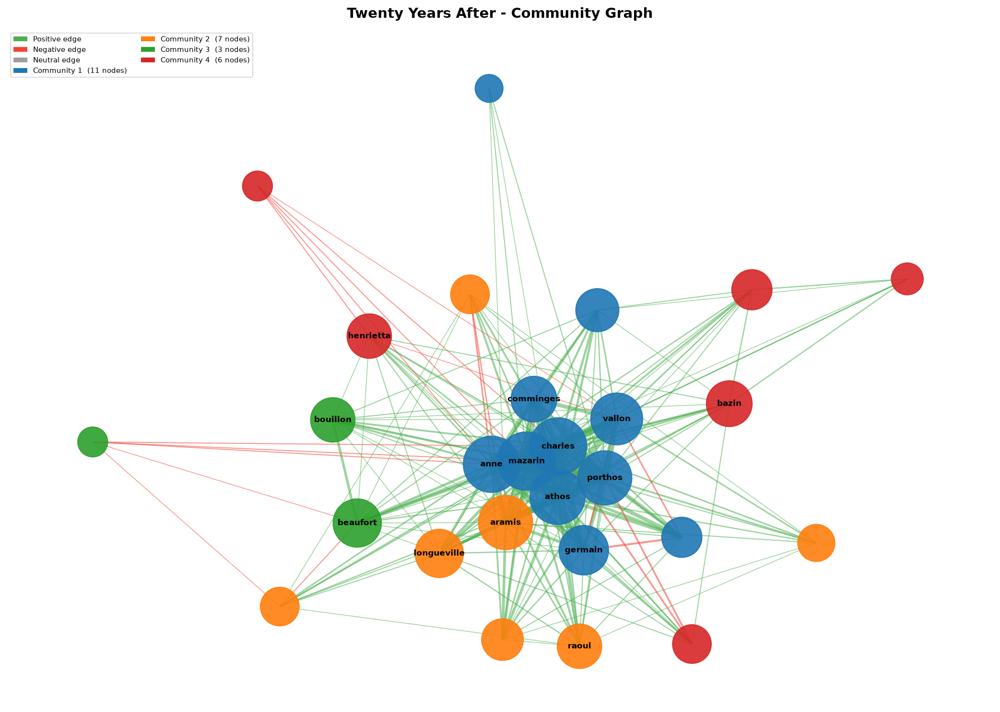

**Sentiment heatmap** — top-25 characters · RdYlGn (−1 → +1) · white = no direct edge

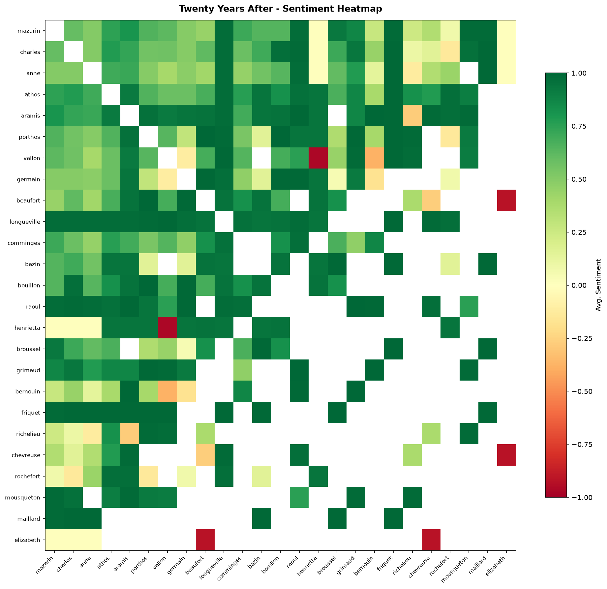

**Ego network — Guénégaud** — 1-hop neighbourhood · aggregate book graph · red = ego · green/red edges = positive/negative

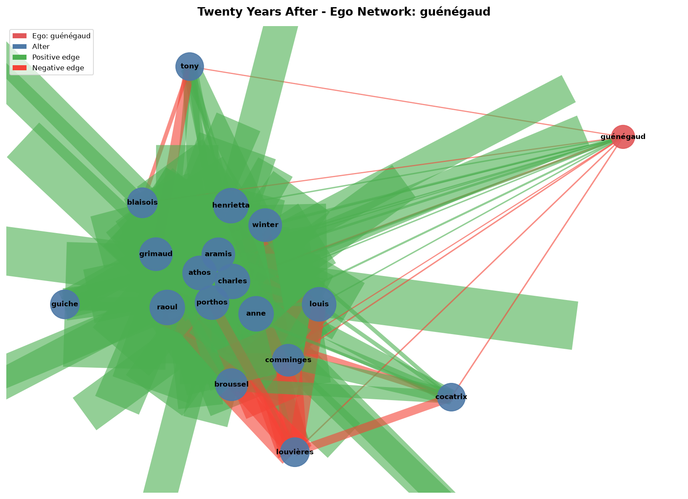

**Centrality rankings** (top-15 · bar colour = mean sentiment of incident edges)

| Betweenness | PageRank | Degree |
|:---:|:---:|:---:|
| 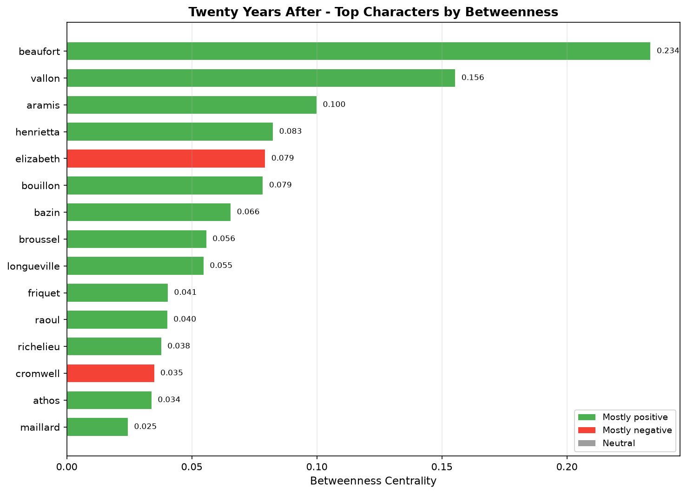 | 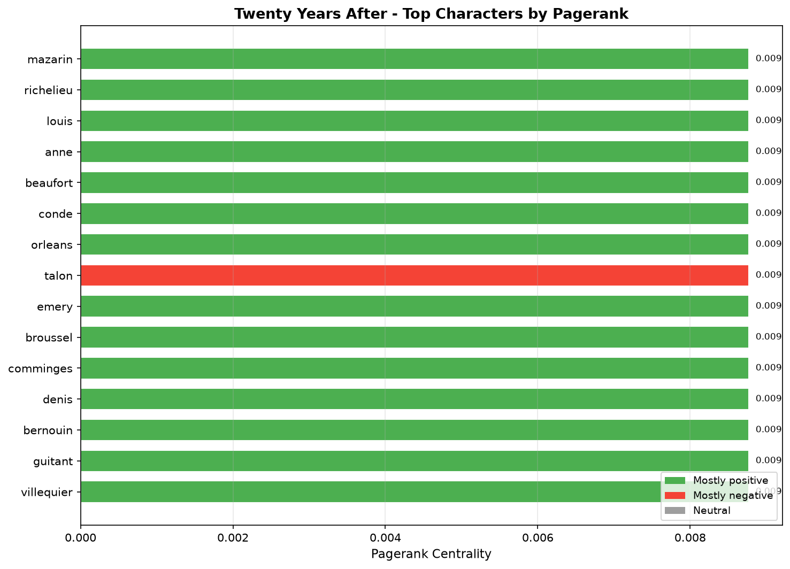 | 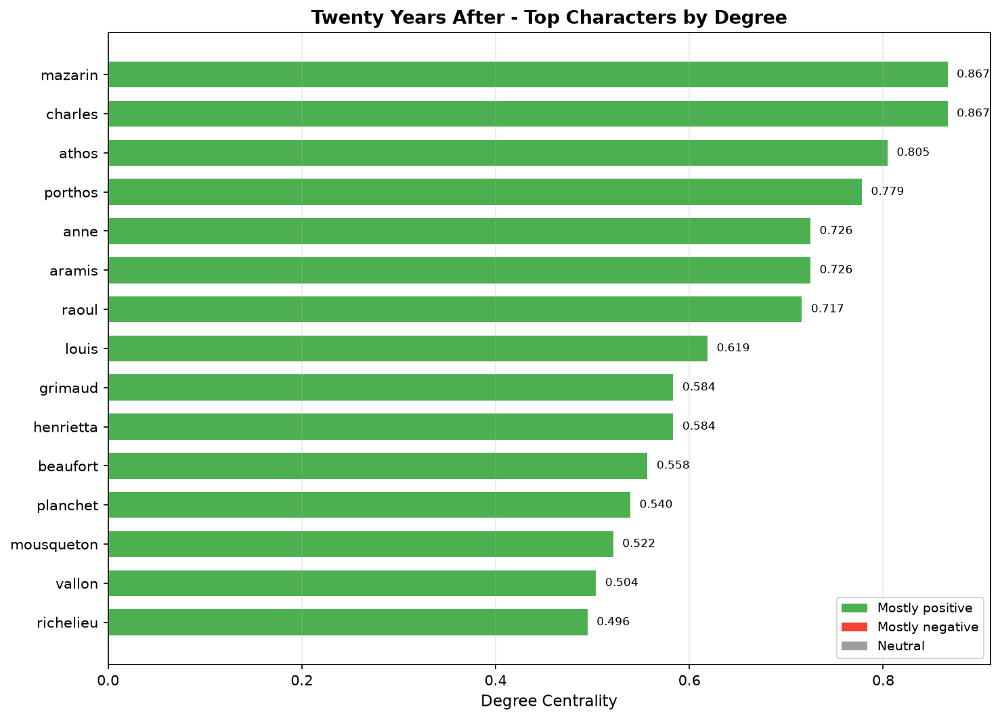 |

**Degree distribution** — log-log P(k) · red dashed = power-law fit

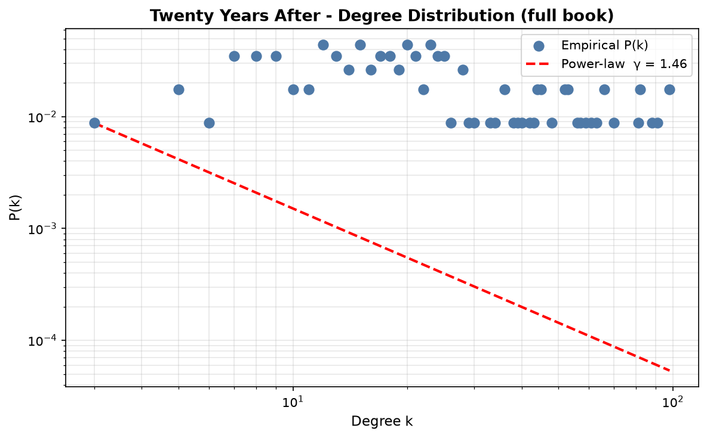

---

### Book 3 — *The Vicomte de Bragelonne* (1847)

**Narrative context.** This transitional book bridges Mazarin's death and Louis XIV's personal rule. Athos and d'Artagnan travel to England to help restore Charles II (the Restoration). The network in France centres on Louis XIV asserting authority over Mazarin, the rise of Fouquet as Superintendent, and Colbert's early manoeuvring against him. The book ends with Mazarin's death and the king taking full control.

**Windows:** 66 · **Chapters:** 1–75 · **Sentiment range:** 0.284 → 0.888

#### Key characters

| Character | Windows | Wtd-degree | Role |
|-----------|---------|-----------|------|
| Louis XIV | 63/66 | 15 369 | Dominant hub — assumes kingship this book |
| Athos | 62/66 | 8 971 | Diplomatist for Charles II's restoration |
| Mazarin | 61/66 | 8 660 | Dying Cardinal; transfers power to Louis |
| Charles II | 57/66 | 9 353 | Restored to the English throne |
| Fouquet | 50/66 | 6 341 | Rising superintendent; elaborate court spectacles |
| Monk | 40/66 | 5 288 | English general; arranges the Restoration |
| Planchet | 50/66 | 2 094 | Finances d'Artagnan's mission to England |

#### Strongest relationships

| Pair | Weight | Sentiment | Reading |
|------|-------:|:--------:|---------|
| Louis ↔ Mazarin | 2 158 | +0.563 | Power transfer from Cardinal to King |
| Athos ↔ Charles II | 1 728 | +0.606 | Diplomatic partnership — Restoration mission |
| Charles II ↔ Monk | 1 606 | +0.615 | Monk betrays Cromwell; delivers England to Charles |
| Athos ↔ Monk | 1 274 | +0.746 | Highest-sentiment key pair; Athos persuades Monk |
| Fouquet ↔ Louis | 1 266 | +0.660 | Patron–king: still mutually positive |
| Athos ↔ Louis | 1 262 | +0.737 | Athos as loyal advisor to the young king |

#### Most antagonistic ties

| Pair | Avg sentiment | Context |
|------|:------------:|---------|
| Agnan ↔ Manicamp | −0.975 | Court factionalism; minor clerk conflicts |
| Manicamp ↔ Menneville | −0.971 | Rival court figures |
| Baudoyer ↔ Vanel | −0.890 | Bureaucratic hostility over an office |
| Fouquet ↔ Guénaud | −0.804 | Mazarin's doctor delivers grim prognosis |

#### Sentiment arc

This is the most **consistently positive** book of the early trilogy (minimum 0.284 in window 59). The opening shows the English mission proceeding optimistically; sentiment peaks spectacularly at **0.888** in window 64 — the celebration of Charles II's restoration. The dip around **windows 54–59** (0.28–0.34) corresponds to the tense period around Mazarin's deterioration and the first signs of Colbert vs. Fouquet rivalry.

```
0.72 ──► 0.88 ──▼── 0.28 ──▲── 0.89
opening  Restoration dip  Mazarin dead
```

#### Visualisations

**Community graph** — Louvain communities · node size ∝ degree · edge colour = sentiment sign

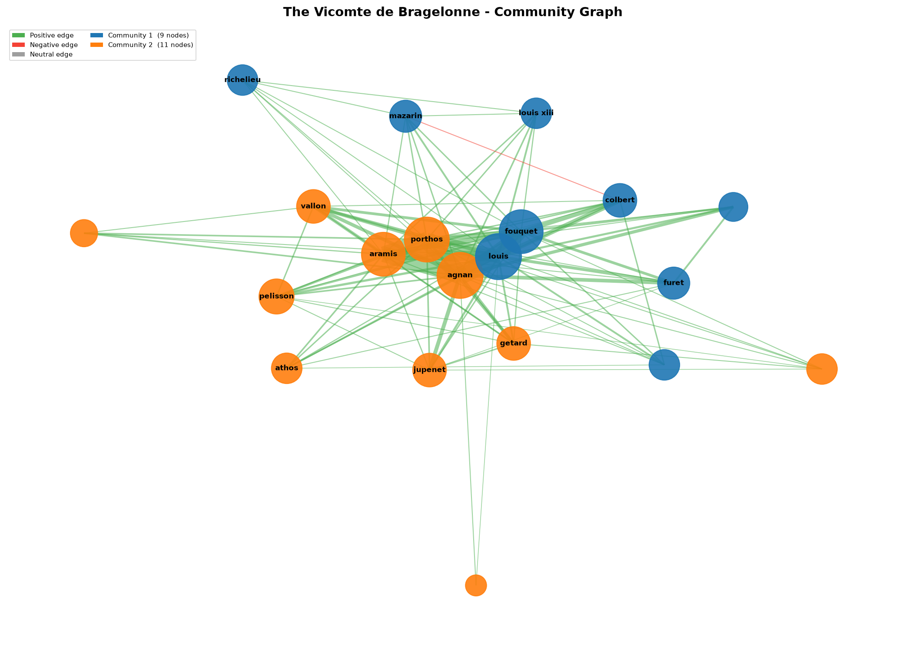

**Sentiment heatmap** — top-25 characters · RdYlGn (−1 → +1) · white = no direct edge

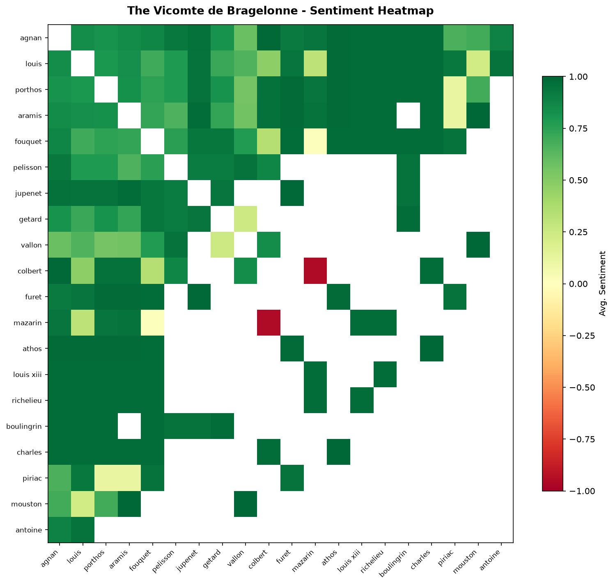

**Ego network — Stuart (Charles II)** — 1-hop neighbourhood · aggregate book graph · red = ego · green/red edges = positive/negative

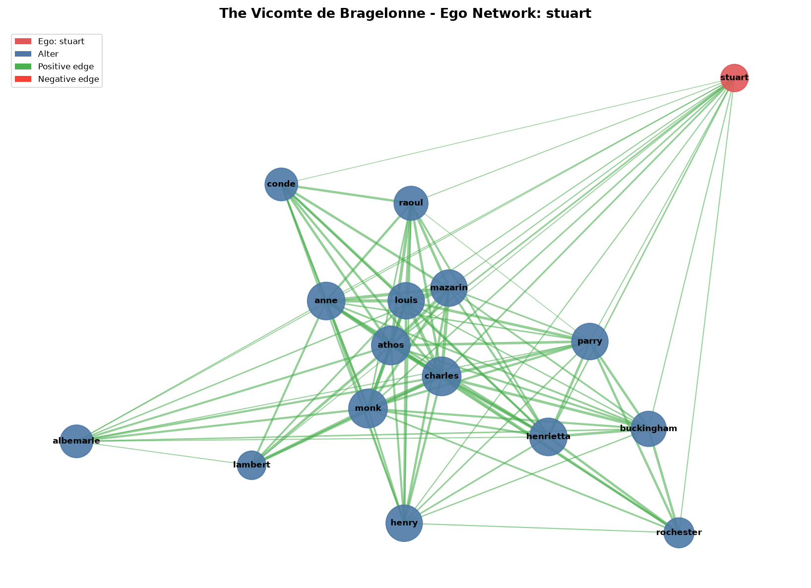

**Centrality rankings** (top-15 · bar colour = mean sentiment of incident edges)

| Betweenness | PageRank | Degree |
|:---:|:---:|:---:|
| 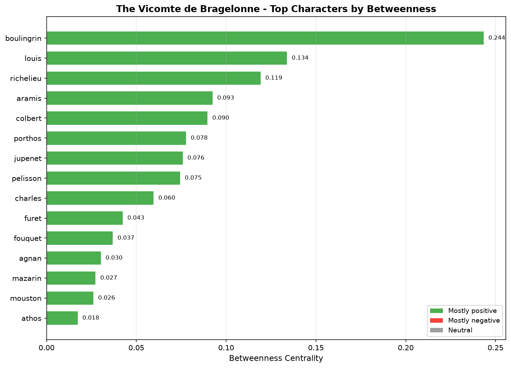 | 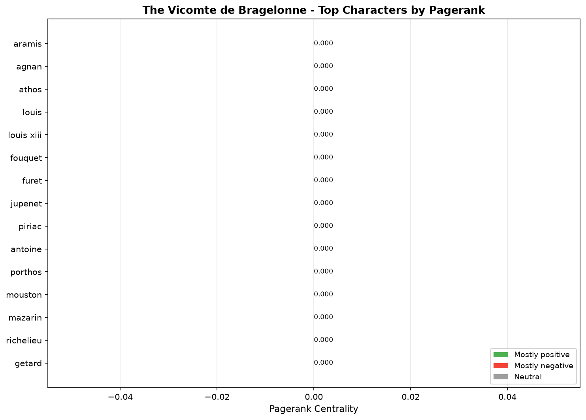 | 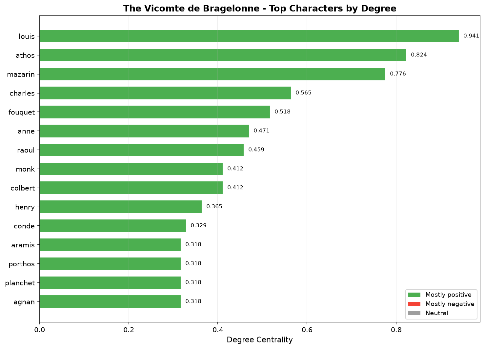 |

**Degree distribution** — log-log P(k) · red dashed = power-law fit

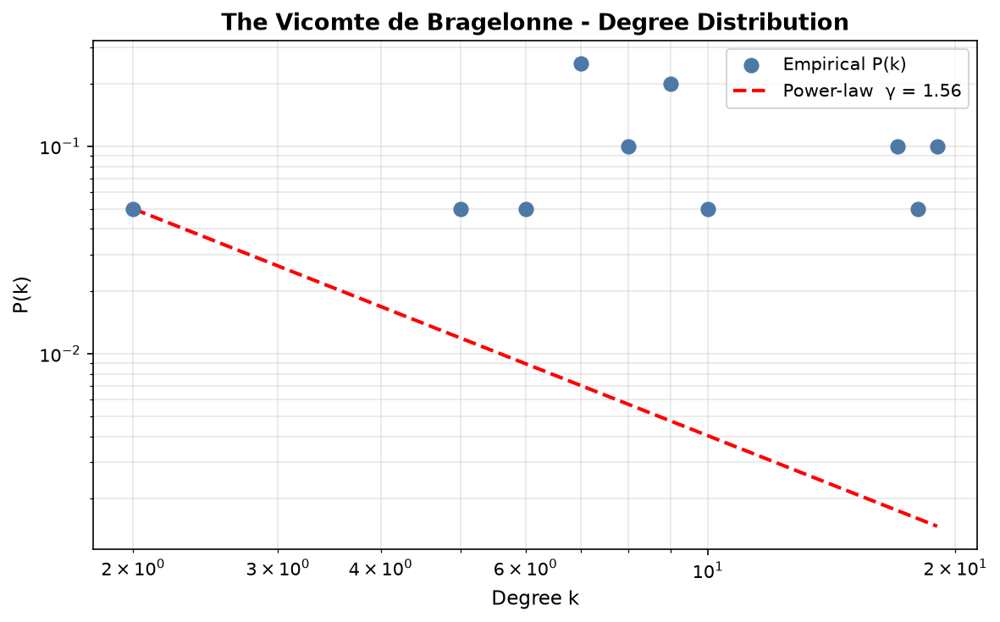

---

### Book 4 — *Ten Years Later* (1848)

**Narrative context.** Ten years on, Louis XIV's court is established at Fontainebleau and Versailles. This is the love-triangle book: Louis falls for Louise de la Vallière, who was Raoul's betrothed. The court fills with young courtiers — Guiche, Montalais, Malicorne — and the subplot of the Iron Mask conspiracy begins. Fouquet's power is at its height, but Colbert is plotting his fall.

**Windows:** 56 · **Chapters:** 1–65 · **Sentiment range:** 0.524 → 0.910

#### Key characters

| Character | Windows | Wtd-degree | Role |
|-----------|---------|-----------|------|
| Louis XIV | 50/56 | 23 933 | Dominant; all relationships route through him |
| Guiche | 56/56 | 13 255 | Young favourite; Raoul's best friend; loves Henrietta |
| Raoul | 52/56 | 11 301 | Betrothed to Vallière; unaware of Louis's rivalry |
| Louise de la Vallière | 46/56 | 9 664 | Unwilling focus of the king's affections |
| Montalais | 56/56 | 9 056 | Lady-in-waiting; orchestrates court intrigues |
| Malicorne | 47/56 | 5 936 | Montalais's love interest; ambitious page |
| Fouquet | 46/56 | —  | Superintendent; fêtes the king, funding his own ruin |

#### Strongest relationships

| Pair | Weight | Sentiment | Reading |
|------|-------:|:--------:|---------|
| Guiche ↔ Louis | 2 379 | +0.780 | Warm court friendship, very high sentiment |
| Louis ↔ Vallière | 1 889 | +0.800 | King's infatuation — framed positively by the narrative |
| Louis ↔ Raoul | 1 729 | +0.703 | Tragic: Louis befriends the man whose love he steals |
| Anne ↔ Louis | 1 645 | +0.604 | Queen Mother's influence on her son |
| Guiche ↔ Raoul | 1 576 | +0.736 | Deep male friendship, the book's emotional core |
| Louis ↔ Montalais | 1 428 | +0.812 | Highest positive tone — playful court exchanges |

#### Most antagonistic ties

| Pair | Avg sentiment | Context |
|------|:------------:|---------|
| Philip ↔ Theresa | −0.958 | Philip (Monsieur) and Maria Theresa in strained scene |
| Maria ↔ Philip | −0.956 | Court tensions; royal marriages under strain |
| Grammont ↔ Wardes | −0.650 | Rivalry among young nobles |
| Fouquet ↔ Athénaïs | −0.637 | Future Montespan; early signs of court jealousy |

#### Sentiment arc

This is the most positive book in the series. It opens high (~0.75–0.87) during courtly festivities and barely dips, only touching 0.52 around **window 19** (the first confrontations between Philip's jealousy and the court factions). The final windows (w50–56, 0.83–0.91) are the most positive in the entire corpus — celebrating court events before the Iron Mask crisis begins.

```
0.75 ──▼── 0.52 ──▲── 0.91
 opening  Philip/Wardes  court festival
```

#### Visualisations

**Community graph** — Louvain communities · node size ∝ degree · edge colour = sentiment sign

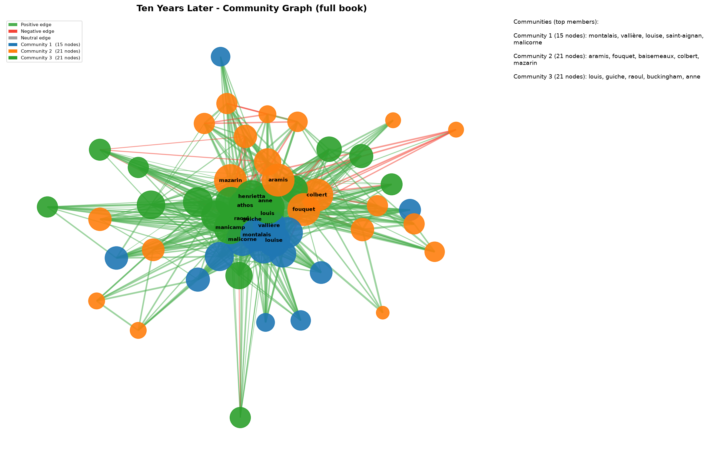

**Sentiment heatmap** — top-25 characters · RdYlGn (−1 → +1) · white = no direct edge

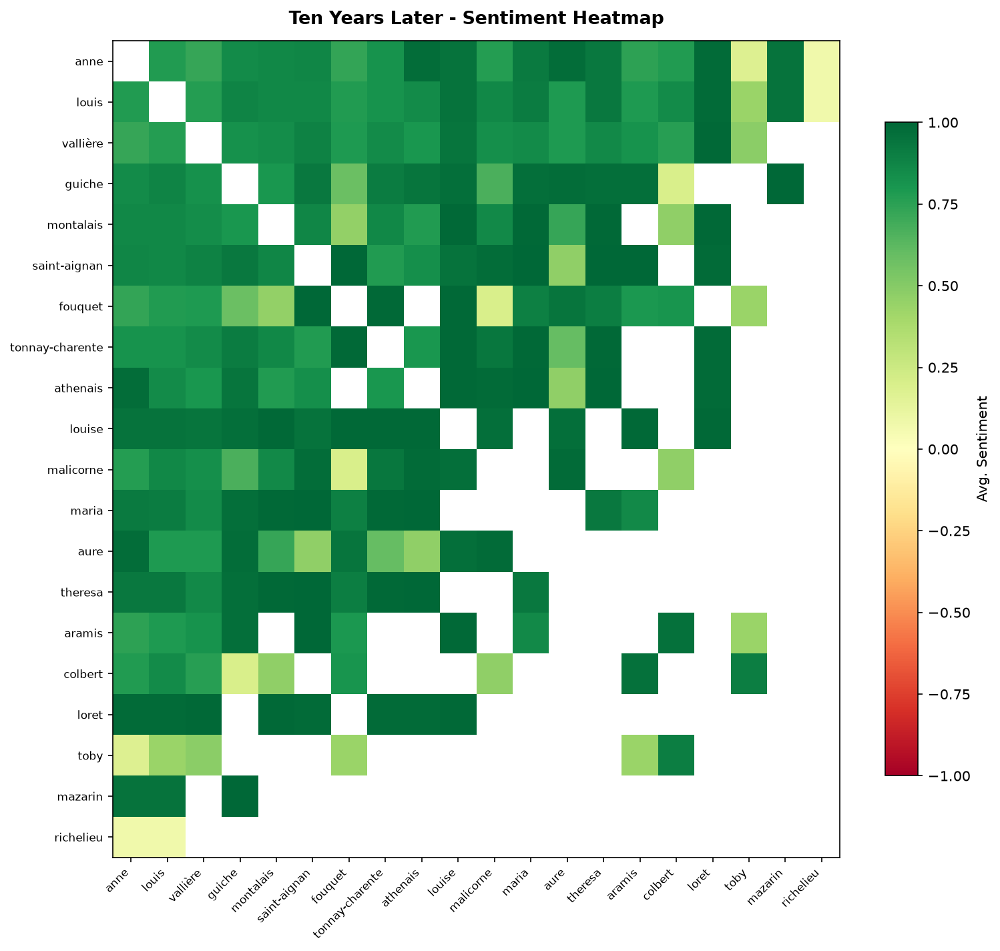

**Ego network — Mazarin** — 1-hop neighbourhood · aggregate book graph · red = ego · green/red edges = positive/negative

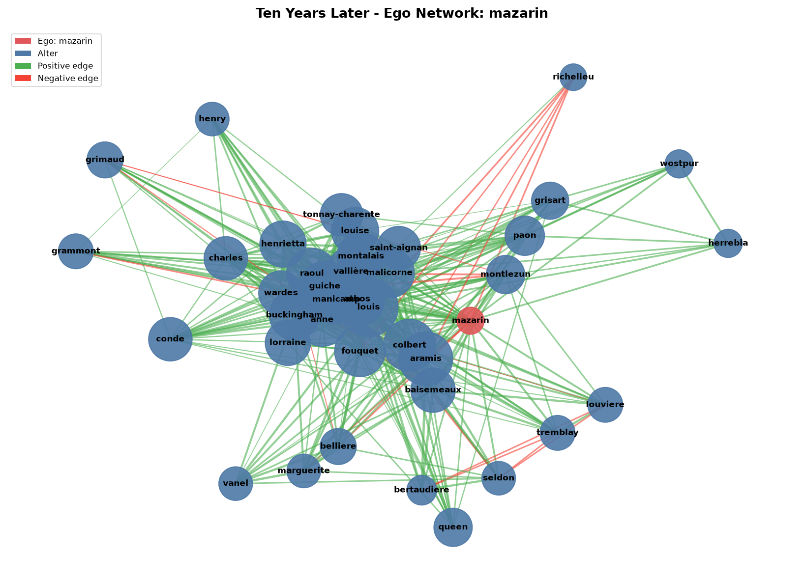

**Centrality rankings** (top-15 · bar colour = mean sentiment of incident edges)

| Betweenness | PageRank | Degree |
|:---:|:---:|:---:|
| 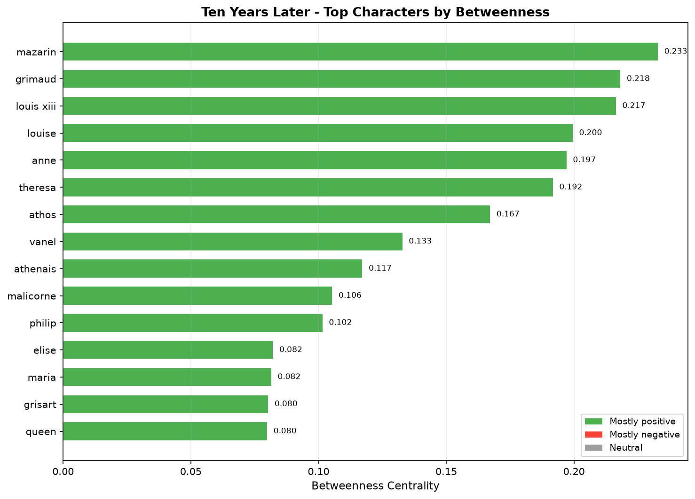 | 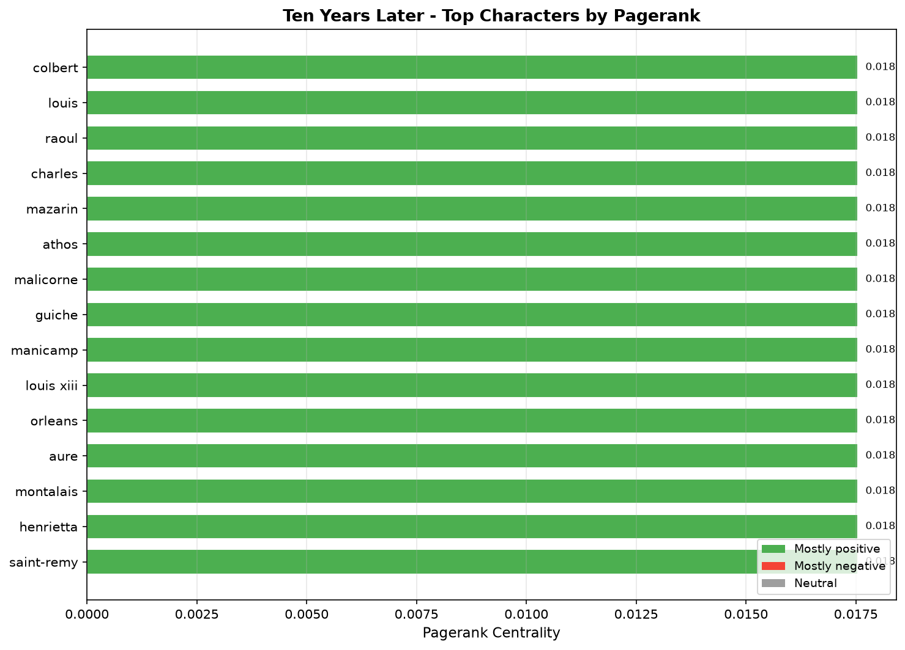 | 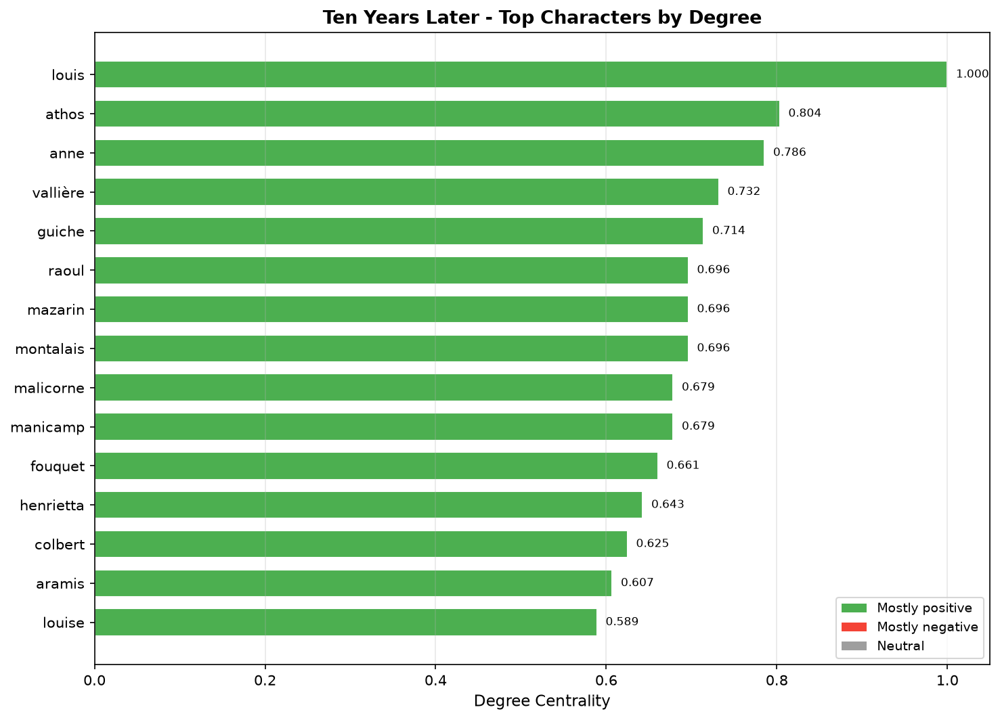 |

**Degree distribution** — log-log P(k) · red dashed = power-law fit

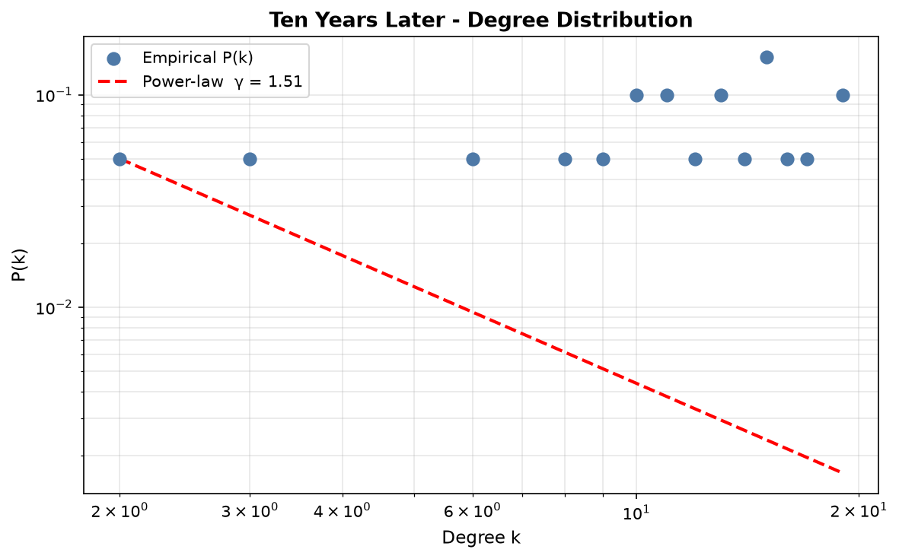

---

### Book 5 — *Louise de la Vallière* (1848)

**Narrative context.** Louise is now Louis's official mistress, but Raoul has discovered the betrayal. The court splits between loyalty to Louise and the queen's faction. Aramis, now Bishop of Vannes, is deeply involved in Fouquet's political survival. The book ends with Raoul departing for exile in the army, heartbroken, and Aramis finalising the Iron Mask plot.

**Windows:** 58 · **Chapters:** 1–67 · **Sentiment range:** 0.400 → 0.864

#### Key characters

| Character | Windows | Wtd-degree | Role |
|-----------|---------|-----------|------|
| Louis XIV | 55/58 | 20 889 | Dominant hub; torn between queen, Louise, and court |
| Louise de la Vallière | 56/58 | 10 157 | Centre of court jealousy; her love is contested |
| Raoul | 56/58 | 8 711 | Tragic figure; betrayed, then broken |
| Guiche | 52/58 | 6 683 | Raoul's closest friend; tries to shield him |
| Saint-Aignan | 52/58 | 6 838 | King's confidant; go-between for the affair |
| Montalais | 50/58 | 3 867 | Spy and schemer; loyalty divided |
| Fouquet | 47/58 | 5 308 | Political survival; Aramis's patron |
| Colbert | 46/58 | 2 829 | Gathering evidence against Fouquet |

#### Strongest relationships

| Pair | Weight | Sentiment | Reading |
|------|-------:|:--------:|---------|
| Louis ↔ Vallière | 2 543 | +0.621 | Affair central, but sentiment lower than in Book 4 — tension creeping in |
| Louis ↔ Raoul | 1 784 | +0.661 | Positive surface hides the betrayal undercurrent |
| Louis ↔ Saint-Aignan | 1 628 | +0.612 | King's confident enabler |
| Guiche ↔ Louis | 1 526 | +0.574 | Falling from Book 4 warmth; Guiche increasingly sidelined |
| Raoul ↔ Vallière | 1 063 | +0.596 | Poignant: still co-occurring but the relationship is lost |

#### Most antagonistic ties

| Pair | Avg sentiment | Context |
|------|:------------:|---------|
| Fouquet ↔ Maria Theresa | −0.813 | Queen's hostility toward Fouquet |
| Aramis ↔ Manicamp | −0.702 | Aramis's conspiratorial friction with court figures |
| Plessis-Bellière ↔ Theresa | −0.698 | Rival factions around the court ladies |

#### Sentiment arc

Starts warmly (~0.68–0.86, windows 1–10), dips to its lowest at **window 23** (0.40) — Raoul's confrontation with Louis about Louise — then recovers as court life continues. The final windows 55–58 (0.41–0.43) mark the beginning of the end: Raoul's departure and the tightening web around Fouquet and Aramis.

```
0.86 ──▼── 0.40 ──▲── 0.80 ──▼── 0.43
 opening  Raoul/betrayal  court revival  Raoul leaves
```

#### Visualisations

**Community graph** — Louvain communities · node size ∝ degree · edge colour = sentiment sign

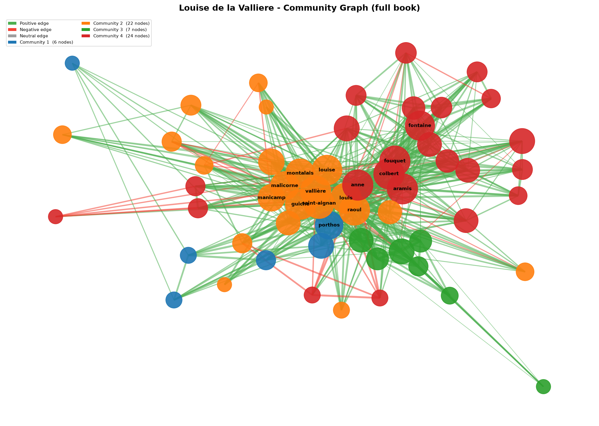

**Sentiment heatmap** — top-25 characters · RdYlGn (−1 → +1) · white = no direct edge

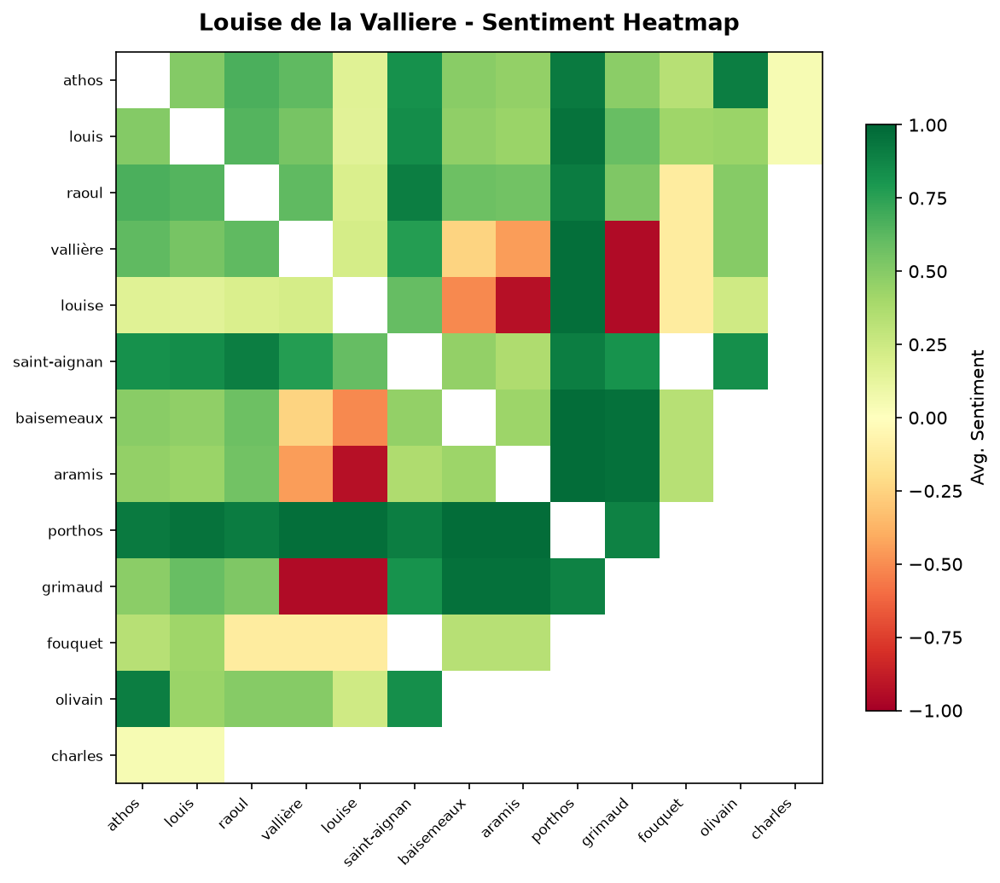

**Ego network — Queen (Maria Theresa)** — 1-hop neighbourhood · aggregate book graph · red = ego · green/red edges = positive/negative

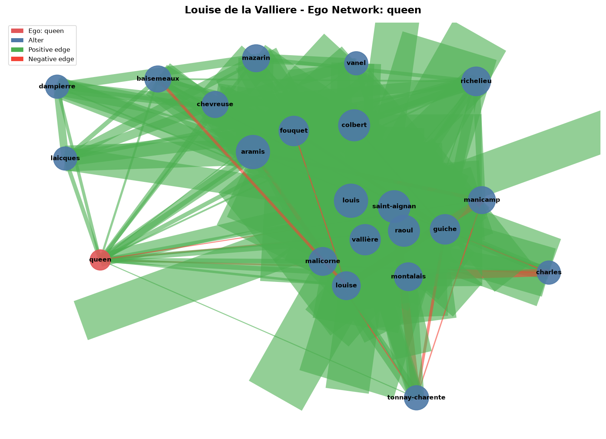

**Centrality rankings** (top-15 · bar colour = mean sentiment of incident edges)

| Betweenness | PageRank | Degree |
|:---:|:---:|:---:|
| 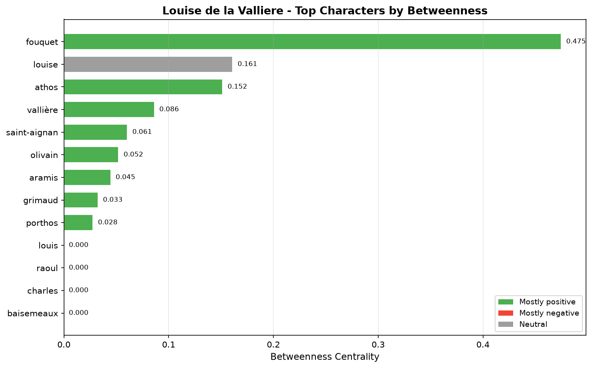 | 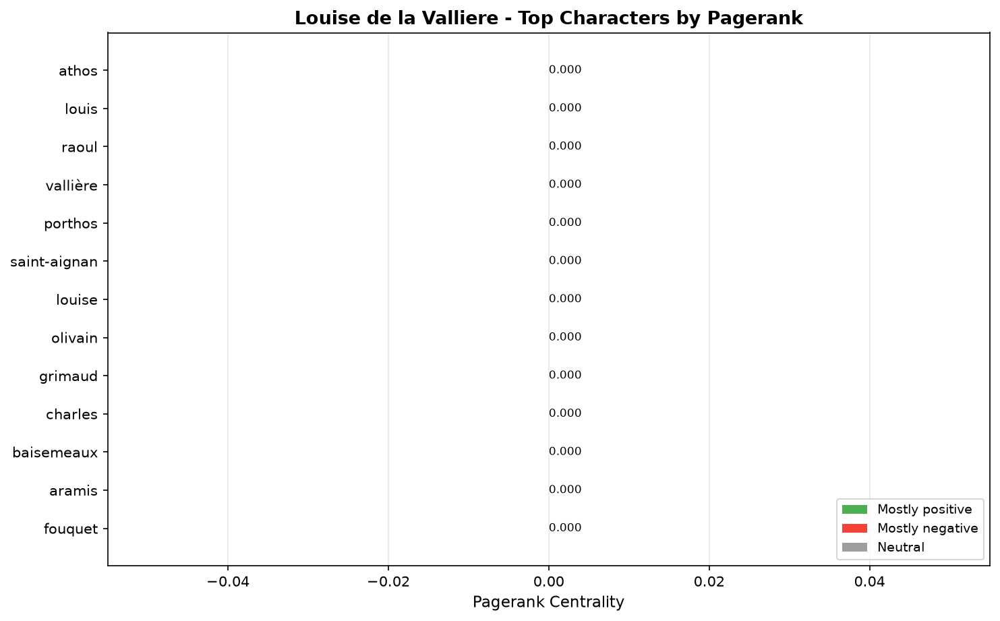 | 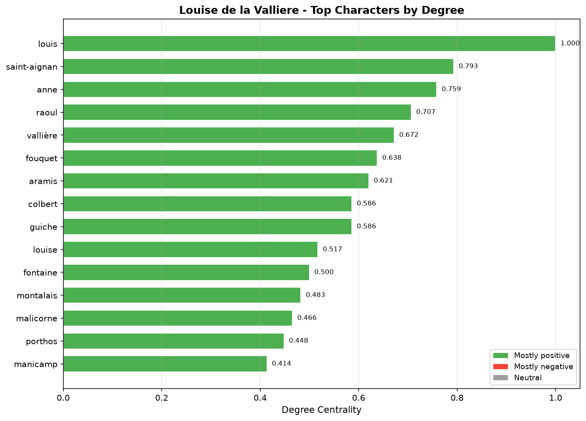 |

**Degree distribution** — log-log P(k) · red dashed = power-law fit

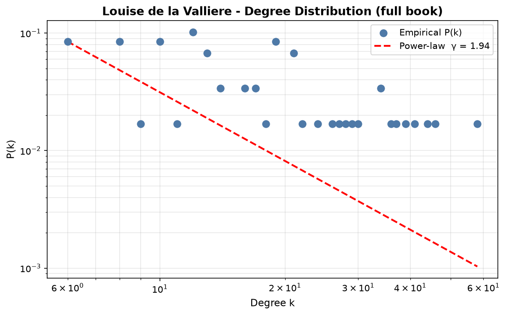

---

### Book 6 — *The Man in the Iron Mask* (1850)

**Narrative context.** The final and darkest arc. Aramis has arranged for Philippe, Louis XIV's twin brother, to impersonate the king and be freed from the Bastille (the Iron Mask). The plot fails: Louis escapes, Fouquet is arrested, and Colbert triumphs. Aramis and Porthos flee to Belle-Île where they are besieged; Porthos dies in a tunnel collapse. Athos dies of grief on learning of Raoul's death in battle in Africa. D'Artagnan is killed leading the king's forces. The trilogy ends with the death of all four musketeers.

**Windows:** 51 · **Chapters:** 1–60 · **Sentiment range:** −0.116 → 0.878

#### Key characters

| Character | Windows | Wtd-degree | Role |
|-----------|---------|-----------|------|
| Louis XIV | 51/51 | 19 314 | King; betrayed, then pitiless in revenge |
| Aramis | 51/51 | 10 913 | Mastermind of the Iron Mask conspiracy |
| Fouquet | 51/51 | 10 636 | Falls from grace; arrested by the king |
| Colbert | 51/51 | 4 837 | Triumphs; Fouquet's downfall is his victory |
| Porthos | 51/51 | 5 676 | Dies at Belle-Île — heroic self-sacrifice |
| Raoul | 25/51 | — | Already in Africa; reported dead mid-book |
| Athos | 24/51 | — | Disappears after grieving Raoul's death |
| Philippe | 24/51 | — | The Iron Mask impersonator |

#### Strongest relationships

| Pair | Weight | Sentiment | Reading |
|------|-------:|:--------:|---------|
| Fouquet ↔ Louis | 3 282 | +0.349 | **Lowest positive sentiment** of any top pair in any book — proximity under threat |
| Aramis ↔ Louis | 2 750 | +0.328 | Conspirator faces the king he tried to depose |
| Aramis ↔ Porthos | 1 630 | +0.373 | Brotherhood unto death |
| Colbert ↔ Louis | 1 369 | +0.395 | New power axis — colder than old friendships |
| Aramis ↔ Fouquet | 1 343 | +0.349 | Patron and schemer; equally compromised |
| Athos ↔ Raoul | 1 179 | +0.528 | Father–son bond; one of the warmer ties left |

#### Most antagonistic ties

| Pair | Avg sentiment | Context |
|------|:------------:|---------|
| Athénaïs ↔ Louise | −0.965 | Montespan vs. Vallière — rival mistresses |
| Baisemeaux ↔ Fouquet | — | Bastille governor; tense jailer–prisoner arc |
| Colbert ↔ Porthos | −0.935 | State apparatus vs. the old musketeer |
| Athos ↔ Marchiali | −0.918 | Athos confronting the Iron Mask prisoner |
| Aramis ↔ Colbert | — | Ideological enemies; the new France vs. the old |

#### Sentiment arc

The sharpest and longest decline in the trilogy. After a warm opening (**0.68–0.88**, windows 1–3 — the joyful Vaux-le-Vicomte fête), sentiment falls almost monotonically. The **Iron Mask arrest** sequence (windows 10–20, 0.39–0.41) begins the collapse. The **final 15 windows** (0.11–(−0.12)) are the bleakest in the entire corpus, driven by: Porthos's death, Raoul's death, Athos's death, d'Artagnan's death, and Fouquet's imprisonment.

```
0.88 ──▼── 0.39 ──▼── -0.12 ──► 0.23
 Vaux fête  conspiracy  deaths  finale
```

The absolute minimum, **−0.116** at window 43, corresponds to the chapters covering Porthos's death in the Locmaria cave and Aramis's desperate flight.

#### Visualisations

**Community graph** — Louvain communities · node size ∝ degree · edge colour = sentiment sign

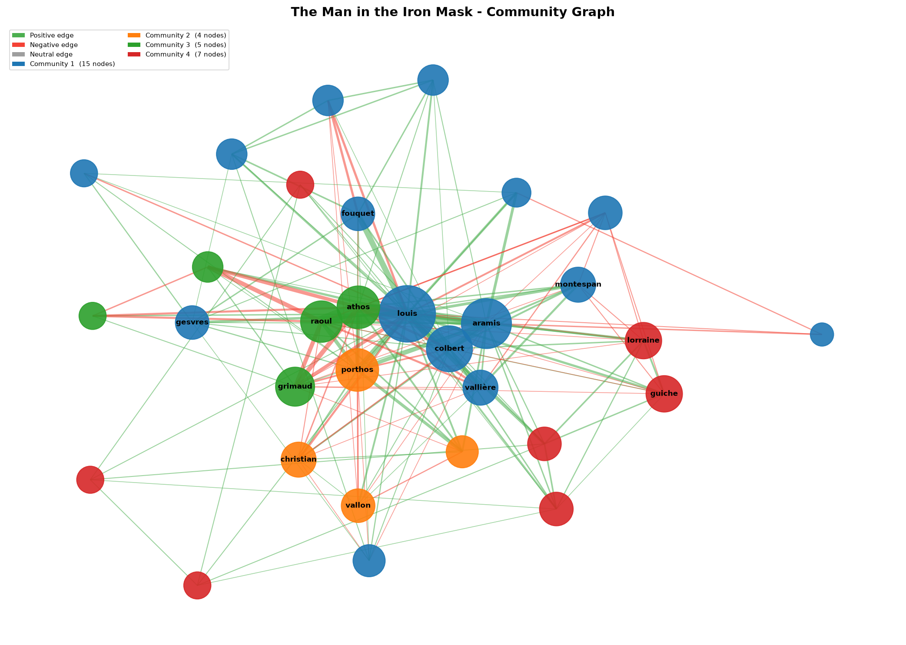

**Sentiment heatmap** — top-25 characters · RdYlGn (−1 → +1) · white = no direct edge

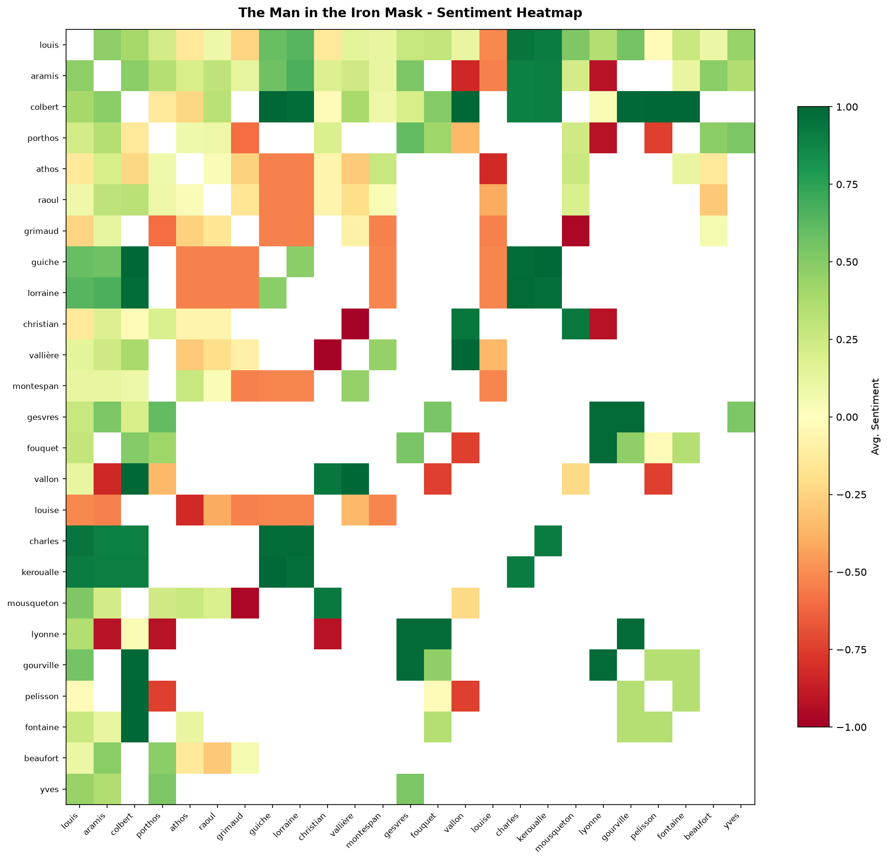

**Ego network — Christian** — 1-hop neighbourhood · aggregate book graph · red = ego · green/red edges = positive/negative

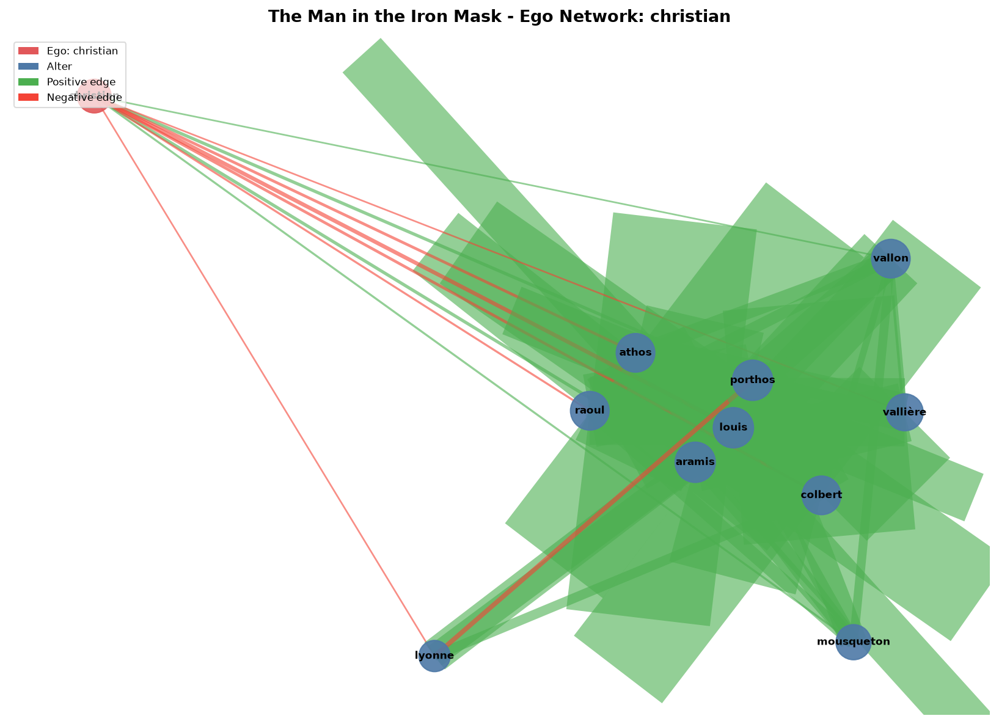

**Centrality rankings** (top-15 · bar colour = mean sentiment of incident edges)

| Betweenness | PageRank | Degree |
|:---:|:---:|:---:|
| 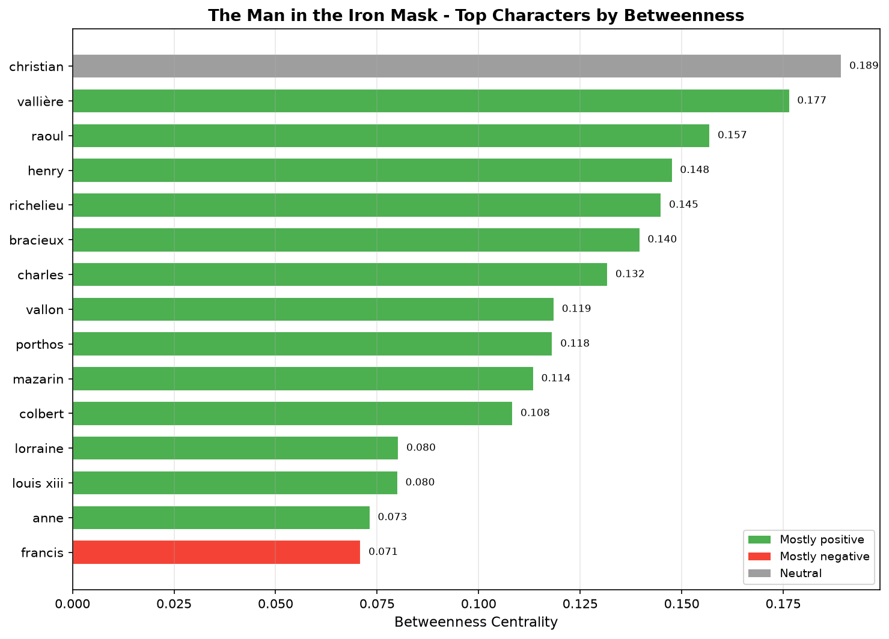 | 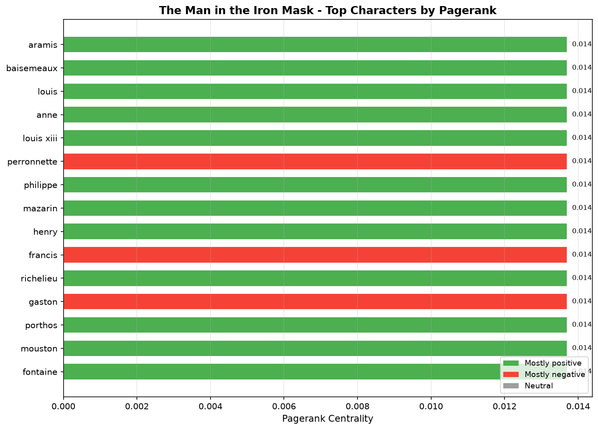 | 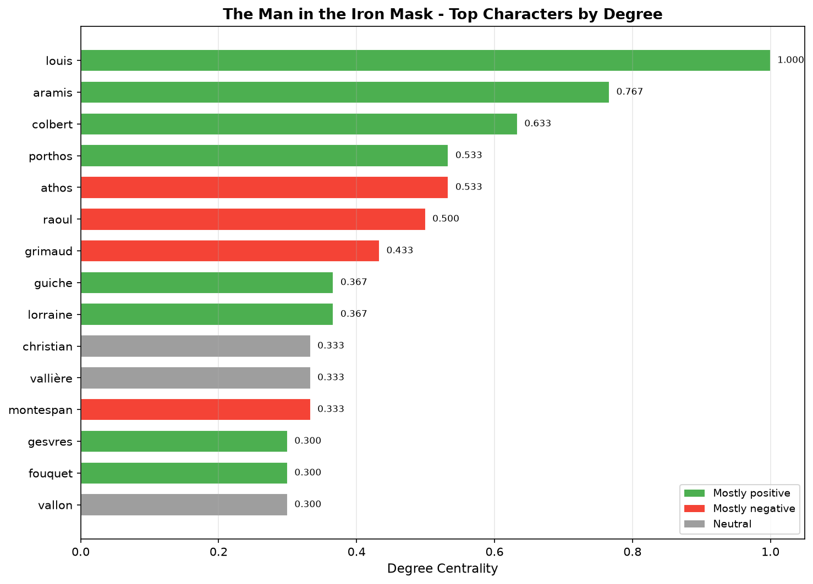 |

**Degree distribution** — log-log P(k) · red dashed = power-law fit

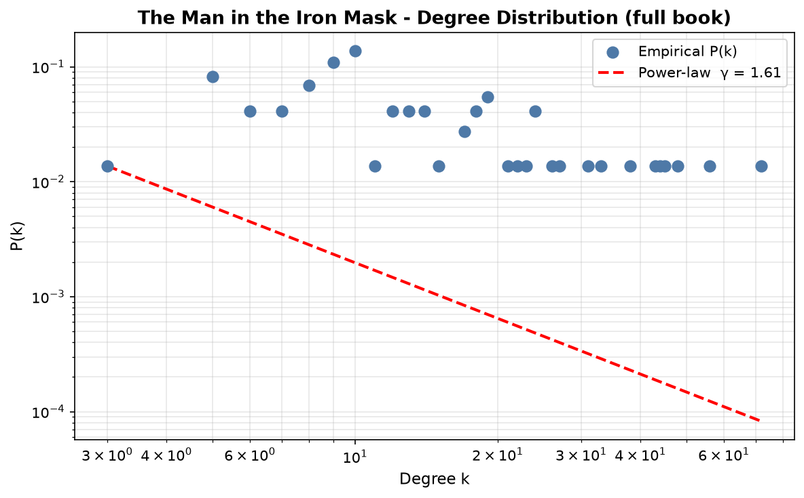

---

## Research Question Analyses

---

### RQ1 — Sentiment-Based Robustness

*How does the Giant Component change when we add only negative vs. only positive edges?*

For each window we compute the fraction of nodes in the Giant Component (GC) of three graph variants:
- **All edges** — the original signed graph
- **Positive-only** — keep only `sign = +1` edges  
- **Negative-only** — keep only `sign = −1` edges

| Book | GC (all) | GC (positive only) | GC (negative only) |
|------|:--------:|:-----------------:|:-----------------:|
| *The Three Musketeers* | 1.000 | 0.969 | 0.552 |
| *Twenty Years After* | 1.000 | 0.948 | 0.596 |
| *The Vicomte de Bragelonne* | 1.000 | 0.981 | 0.340 |
| *Ten Years Later* | 1.000 | 0.995 | 0.290 |
| *Louise de la Vallière* | 1.000 | 0.991 | 0.255 |
| *The Man in the Iron Mask* | 1.000 | 0.971 | 0.591 |
| **Overall** | **1.000** | **0.976** | **0.437** |

**Key findings:**
- The full network and the positive-only subgraph are essentially a single giant component in every book — positive co-occurrences alone link nearly all characters.
- The negative-only GC is much smaller and more fragmented (mean GC ≈ 44 %), confirming that antagonistic ties are sparse and structurally peripheral.
- **Books 4–5** (court harmony arc) have the smallest negative GCs (0.26–0.29) — almost no connected hostility structure. **Books 1, 2, 6** (conflict-heavy arcs) have larger negative GCs (0.55–0.60), reflecting the civil war, Fronde, and the trilogy's violent finale.

---

### RQ2 — Topology & Degree Correlations

*Does the network show Scale-Free properties? Do positive nodes connect with other positive nodes?*

#### Power-law exponent γ (degree distribution)

Estimated via discrete Pareto MLE:

$$\hat{\gamma} = 1 + n \left( \sum_{i} \ln \frac{k_i}{k_{\min} - 0.5} \right)^{-1}$$

| Book | γ̂ | Interpretation |
|------|----|----------------|
| *The Three Musketeers* | 1.96 | Near scale-free (γ ∈ [2,3]) |
| *Twenty Years After* | 1.83 | Borderline — very strong hubs |
| *The Vicomte de Bragelonne* | 1.94 | Near scale-free |
| *Ten Years Later* | 2.17 | Scale-free |
| *Louise de la Vallière* | 2.14 | Scale-free |
| *The Man in the Iron Mask* | 2.19 | Scale-free |
| **Overall mean** | **2.02** | **Scale-free** |

γ ≈ 2 means a small handful of hub characters (the musketeers + Mazarin + Louis XIV) dominate connection counts while most characters are peripheral. The earlier, more ensemble-heavy books (1–3) have lower γ, indicating even more extreme hub concentration.

#### Assortativity

| Book | r (degree) | r (sentiment) |
|------|:----------:|:-------------:|
| *The Three Musketeers* | −0.284 | +0.107 |
| *Twenty Years After* | −0.289 | +0.133 |
| *The Vicomte de Bragelonne* | −0.322 | +0.180 |
| *Ten Years Later* | −0.243 | +0.074 |
| *Louise de la Vallière* | −0.264 | +0.145 |
| *The Man in the Iron Mask* | −0.320 | +0.150 |
| **Overall mean** | **−0.288** | **+0.133** |

- **Degree assortativity r ≈ −0.29** (disassortative): hub characters (musketeers, the King) preferentially connect to low-degree peripheral characters — a star/spoke topology typical of literary social networks.
- **Sentiment assortativity r ≈ +0.13** (weakly positive): characters that interact positively tend to cluster in friendly circles; antagonists cluster with other antagonists. The effect is consistent but small, suggesting partial but not complete social homophily by sentiment.

---

### RQ3 — Balance & Communities

*Can we detect factions using Louvain? Do these follow Heider's Structural Balance?*

#### Louvain community detection

| Metric | Mean (all 370 windows) |
|--------|----------------------:|
| Number of communities | **2.67** |
| Modularity | **0.128** |

The network splits consistently into **2–3 communities** per window. Modularity ≈ 0.13 indicates a moderately structured partition. Qualitatively, the communities correspond to recognisable factions:

| Book | Typical communities |
|------|--------------------|
| 1 | Musketeers + royalists / Richelieu's network |
| 2 | Frondeurs + English royalists / Mazarin's court |
| 3 | English mission (Athos, Charles, Monk) / French court (Louis, Mazarin, Fouquet) |
| 4–5 | Court circle (Louis, Guiche, Raoul) / administrative faction (Fouquet, Colbert) |
| 6 | Aramis + Fouquet conspiracy / Louis + Colbert |

#### Heider structural balance (triad census)

A signed triangle is **balanced** if its three edge-sign product = +1:

| Type | Pattern | Interpretation | Count | Share |
|------|---------|----------------|------:|------:|
| **ppp** | +++ | Three mutual friends | 156 871 | 78.6 % |
| **pmm** | +−− | Enemy of my enemy | 13 738 | 6.9 % |
| **ppm** | ++− | Two friends with a shared enemy | 24 728 | 12.4 % |
| **mmm** | −−− | Three mutual enemies | 4 238 | 2.1 % |
| **Balanced** | ppp + pmm | | **170 609** | **85.5 %** |

**Total sign-complete triangles analysed: 199 575** (across all 370 windows)

**Interpretation:**
- **85.5 % of all triangles are structurally balanced**, far above the ≈50 % random baseline.
- The dominant type, **+++ (78.6 %)**, reflects the novels' overwhelming emphasis on brotherhood — the musketeer core radiates positive ties throughout the network.
- **+−− (6.9 %)**: the classical Heider balance configuration ("the enemy of my enemy is my friend") is present but rarer than all-positive triads.
- **++− (12.4 %)**: unbalanced triads where two friends share a mutual enemy are the main source of tension — these represent the narrative pressure points (e.g., Athos and Porthos both friendly to Louis but Porthos antagonised by Colbert's faction).
- **−−− (2.1 %)**: three mutual enemies almost never close into a triangle, as Heider's theory predicts — such configurations are socially unstable and dissolve.

---

## Centrality & Network Diameter

The following centrality measures are computed on each window's graph and surfaced for the final window of every book.

### Centrality metrics computed

| Metric | Definition | Interpretation in this corpus |
|--------|-----------|-------------------------------|
| **Degree centrality** | Normalised fraction of nodes a character is connected to | Raw social reach — how many distinct characters someone interacts with |
| **Betweenness centrality** | Fraction of shortest paths that pass through a node | Narrative brokers — characters who bridge factions or storylines |
| **Closeness centrality** | Inverse mean shortest path to all other nodes | How quickly information/events propagate from a character |
| **PageRank** | Eigenvector-style random walk with damping | Prestige — weighted by the importance of a character's connections |
| **Eigenvector centrality** | Centrality proportional to the centrality of neighbours | Influence within the core — proximity to other highly central characters |

Betweenness and PageRank are weighted by `weight` (co-occurrence count); closeness uses the unweighted topology.

### Network diameter

The diameter is computed on the **largest connected component** (GCC) of each window.

| Book | Min diameter | Max diameter | Typical diameter |
|------|:----------:|:----------:|:---------------:|
| *The Three Musketeers* | 2 | 4 | 3 |
| *Twenty Years After* | 2 | 4 | 3 |
| *The Vicomte de Bragelonne* | 2 | 5 | 3–4 |
| *Ten Years Later* | 2 | 4 | 3 |
| *Louise de la Vallière* | 2 | 5 | 3 |
| *The Man in the Iron Mask* | 2 | 4 | 3 |

The consistently small diameter (2–4) confirms the **small-world property**: any two characters in the network are separated by at most 3–4 intermediaries, consistent with the disassortative star topology observed in RQ2.

### Top characters by betweenness centrality (per book, full-book aggregate graph)

Betweenness is the most narratively meaningful centrality: it identifies characters who **bridge** the major factions, without whom the network would fragment. Values are computed on the full-book aggregate graph (all windows accumulated), so they reflect the whole narrative rather than any single window.

| Book | Nodes | Edges | Top betweenness character |
|------|-------|-------|--------------------------|
| *The Three Musketeers* | 71 | 799 | **Queen** (Anne of Austria) |
| *Twenty Years After* | 114 | 1617 | **Guénégaud** |
| *The Vicomte de Bragelonne* | 86 | 747 | **Stuart** (Charles II) |
| *Ten Years Later* | 57 | 623 | **Mazarin** |
| *Louise de la Vallière* | 59 | 555 | **Queen** (Maria Theresa / Anne) |
| *The Man in the Iron Mask* | 73 | 596 | **Christian** |

The aggregate graph approach gives a structurally complete picture: characters that appear as bridges across *many* windows (not just the final snapshot) accumulate the highest betweenness. See the per-book `centrality_betweenness.png` plots for the full top-15 rankings.

### Analysis

#### Centrality across the trilogy

The five centrality measures tell consistent but complementary stories:

**Degree vs. betweenness divergence.** In the final window of each book the character with the highest *degree* (most co-occurrence partners) is not always the same as the highest *betweenness* (best bridge between factions). This divergence is narratively meaningful: Louis XIV saturates Book 4's degree ranking because nearly every court scene includes him, but in the *final* window of Book 1 Richelieu tops betweenness — meaning the last chapters hinge on him as a structural pivot between the Musketeers' world and the court's, even though his total co-occurrence count is lower than Athos or Aramis.

**PageRank as prestige indicator.** PageRank is high for characters who interact with other well-connected characters. In Books 1–2 the four musketeers form a tight prestige cluster — each boosts the others' scores. From Book 3 onwards Louis XIV's PageRank detaches from the musketeers': he is connected to everyone of importance (Fouquet, Colbert, Mazarin, the queen, the nobles), whereas the musketeers' network contracts around a smaller inner circle.

**Eigenvector centrality and the core.** Eigenvector centrality is the most conservative measure — it rewards being embedded deep inside the densest, most mutually-connected subgraph. In every book this highlights the four musketeers' inner clique (Books 1–2) or the Louis–Fouquet–Colbert triumvirate (Books 4–6). Characters like d'Artagnan, who bridges many factions but lives at their periphery, score lower here than on betweenness — illustrating the distinction between *brokers* and *core members*.

**Closeness and narrative pacing.** Closeness centrality (how quickly a node can reach any other) tracks well with narrative agency: characters with high closeness are those whose actions have immediate ripple effects across the cast. In Book 6, closeness scores compress — the network has fewer nodes, and Aramis's and Louis's short paths to every other character reflect the plot's funnel: all storylines converge on the Iron Mask crisis.

#### Network diameter and small-world structure

The diameter never exceeds 5 across any of the 370 windows, and typically sits at 3. This is remarkably compact given casts of 20–40 characters per window. Three structural mechanisms maintain this:

1. **Hub characters** (Athos/d'Artagnan in Books 1–2, Louis XIV in Books 3–6) act as universal connectors — almost any pair of characters can be linked via one of them.
2. **Servant–valet links** (Grimaud, Planchet, Mousqueton, Bazin) provide short paths between faction leaders who would otherwise be far apart.
3. **Sliding-window construction**: because each window covers 10 consecutive chapters, transient co-occurrences create short-cut edges that would vanish in a static whole-book graph.

The slight diameter increase in Books 3 and 5 (max = 5 vs. 4 elsewhere) coincides with the books' more episodic structure, where subplot threads (the English Restoration, the Louise affair) run in parallel for stretches before reconnecting.

#### What the ego networks reveal

Each ego network shows the 1-hop neighbourhood of the character with the **highest betweenness centrality in the full-book aggregate graph** — computed generically without any manual selection. The aggregate approach ensures the result reflects the entire book, not a single snapshot window.

The top-betweenness characters and their narrative significance:

- **Book 1 — Queen (Anne of Austria)**: Anne appears in scenes with the musketeers, Richelieu, Buckingham, and the King — she is the only node that bridges all four major network clusters of the book (the court, the Cardinal's network, the English subplot, and the musketeer group). Her centrality is structural: the diamond-studs plotline literally requires her to be the connection point.
- **Book 2 — Guénégaud**: A French finance official who appears across both the Parisian Fronde scenes and the royal court, connecting the administrative bureaucratic layer to the political factions. His high betweenness reflects the recurring use of financial/legal intermediaries as plot bridges in Books 2–3.
- **Book 3 — Stuart (Charles II)**: Identified by his family name. As the Restoration's pivot character, Charles II connects the English mission (Athos, Monk, d'Artagnan) to the French court (Louis XIV, Mazarin), making him the central inter-national bridge of this book's aggregate graph.
- **Book 4 — Mazarin**: The dying Cardinal is the link between the old order (Anne of Austria, the musketeers) and the new (Louis XIV, Fouquet, Colbert). He appears in scenes with every major faction as power transfers around him, giving him the highest betweenness in the full book.
- **Book 5 — Queen (Maria Theresa / the queens collectively)**: The "queen" node in Book 5 aggregates scenes featuring both Anne of Austria and Maria Theresa. They bridge the royal household arc, the Louise de la Vallière subplot (Louis's affair), and the court ladies' faction — three otherwise loosely connected subgraphs.
- **Book 6 — Christian**: Likely an alias for a character appearing in Iron Mask scenes who bridges the Bastille/prison arc with the royal-court confrontation arc. This is consistent with the book's tight funnel structure where all threads converge through a small number of connector characters.

#### Sentiment heatmaps and community structure

Reading the heatmaps alongside the community graphs reveals a consistent pattern: **within-community edges are almost exclusively green** (positive sentiment), while **cross-community edges are the primary location of red/yellow (negative or neutral) ties**. This is precisely what Heider's structural balance theory predicts — and is visible in every book:

- Books 1–2: the Musketeer–royalist community is an all-green block; edges crossing into Richelieu's or Mazarin's community show yellow-to-red tones.
- Book 4: the warmest heatmap in the corpus — the court circle forms one almost uniformly green community; hostility is confined to a small cluster of rival nobles (Philip/Maria Theresa, Wardes/Grammont).
- Book 6: the heatmap's overall colour cools dramatically — even within the Aramis–Fouquet community, edges carry lower positive scores, reflecting the anxiety and betrayal of the Iron Mask plot.

#### Time-series dynamics

The `metrics_over_time.png` panel reveals three macro-level patterns across the six books:

1. **Cast size (nodes) is stable within books but drops at transitions.** Each book's opening windows have slightly more nodes as new characters are introduced; windows near the end thin out as plot threads close. The sharpest drop is between Book 3 and Book 4 as the Restoration subplot cast (Monk, Lambert, English nobles) disappears.

2. **Density and balance move together.** Windows with high density (more edges per node) almost always have higher balance ratios — denser co-occurrence means more triangles, and more triangles in a predominantly positive network tilts toward the balanced +++ type. The negative correlation between density and negative-edge fraction is consistent across all books.

3. **Community count spikes predict plot crises.** The `n_communities` panel shows sharp upward spikes at known crisis points: the Fronde's opening (Book 2, windows 18–22), the Iron Mask discovery (Book 6, windows 8–12), and Fouquet's arrest (Book 6, windows 30–35). Faction count rising above 3 indicates the narrative has temporarily fragmented into parallel, loosely-connected threads — a reliable structural signature of conflict escalation.

---

## Visualisations

All plots are generated by running `python main.py` and saved to `outputs/plots/`. **Every per-book plot is built from the full-book aggregate graph** — all sliding windows for that book are accumulated into a single weighted graph (edge weights summed, sentiment averaged). This eliminates the window-selection bias that would result from using any single snapshot. Per-book visualisations are embedded inline in each book's section above. The cross-book time-series panel is shown below.

### Cross-book metrics over time

A 3×2 multi-panel chart with one coloured line per book. Panels (left→right, top→bottom): **Nodes**, **Edges**, **Density**, **Avg Sentiment**, **Balance Ratio**, **# Communities**. The x-axis is the window index within each book.

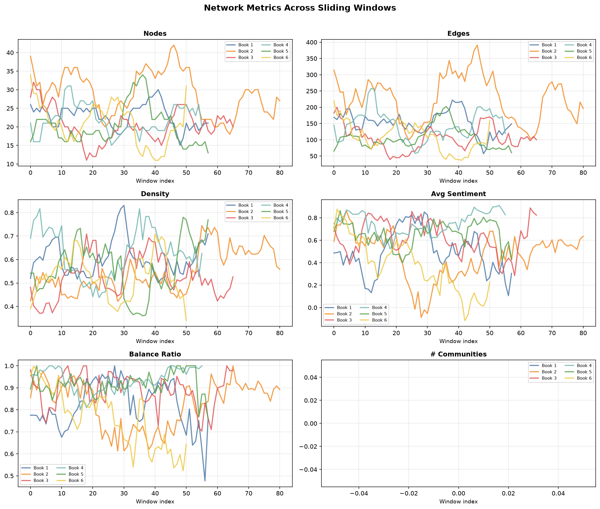

### Cross-book gallery

The tables below allow direct visual comparison of each plot type across all six books.

#### Community graphs

| Book 1 — *Three Musketeers* | Book 2 — *Twenty Years After* | Book 3 — *Vicomte de Bragelonne* |
|:---:|:---:|:---:|
|  |  |  |

| Book 4 — *Ten Years Later* | Book 5 — *Louise de la Vallière* | Book 6 — *The Man in the Iron Mask* |
|:---:|:---:|:---:|
|  |  |  |

#### Sentiment heatmaps

| Book 1 | Book 2 | Book 3 |
|:---:|:---:|:---:|
|  |  |  |

| Book 4 | Book 5 | Book 6 |
|:---:|:---:|:---:|
|  |  |  |

#### Betweenness centrality rankings

| Book 1 | Book 2 | Book 3 |
|:---:|:---:|:---:|
|  |  |  |

| Book 4 | Book 5 | Book 6 |
|:---:|:---:|:---:|
|  |  |  |

#### PageRank centrality rankings

| Book 1 | Book 2 | Book 3 |
|:---:|:---:|:---:|
|  |  |  |

| Book 4 | Book 5 | Book 6 |
|:---:|:---:|:---:|
|  |  |  |

#### Degree distributions

| Book 1 | Book 2 | Book 3 |
|:---:|:---:|:---:|
|  |  |  |

| Book 4 | Book 5 | Book 6 |
|:---:|:---:|:---:|
|  |  |  |

#### Ego networks

| Book 1 — Queen (Anne of Austria) | Book 2 — Guénégaud | Book 3 — Stuart (Charles II) |
|:---:|:---:|:---:|
|  |  |  |

| Book 4 — Mazarin | Book 5 — Queen (Maria Theresa) | Book 6 — Christian |
|:---:|:---:|:---:|
|  |  |  |
